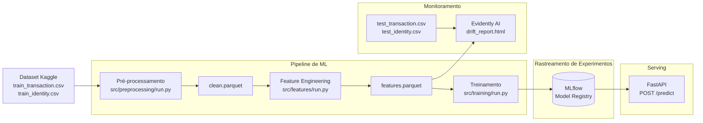

# Detecção de Fraude — Sistema de ML End-to-End

Sistema end-to-end de detecção de fraude construído sobre o dataset [IEEE-CIS Fraud Detection](https://www.kaggle.com/c/ieee-fraud-detection) (~590k transações, ~3.5% de fraudes). O projeto replica a infraestrutura que uma empresa real utilizaria: desde a ingestão dos dados brutos até uma API em produção com monitoramento de drift.

---

## Arquitetura



---

## Stack

| Camada | Ferramenta |
|---|---|
| Processamento de dados | Pandas + Parquet |
| Modelo | LightGBM |
| Rastreamento de experimentos | MLflow |
| API | FastAPI |
| Monitoramento de drift | Evidently AI |
| Infraestrutura | Docker Compose |

---

## Estrutura do Projeto

```
fraud-detection/
├── data/
│   ├── raw/                    # coloque os CSVs do Kaggle aqui
│   └── processed/              # arquivos parquet gerados automaticamente
├── src/
│   ├── preprocessing/          # merge, limpeza e encoding
│   ├── features/               # criação de features
│   ├── training/               # lgbm + rastreamento com mlflow
│   ├── api/                    # endpoint de predição com fastapi
│   └── monitoring/             # relatório de drift com evidently
├── reports/                    # relatórios html gerados
├── mlflow/                     # armazenamento do mlflow
├── docker/
│   ├── Dockerfile.api
│   └── Dockerfile.mlflow
├── docker-compose.yml
└── requirements.txt
```

---


## Como Executar

**1. Baixar o dataset**

Faça o download no [Kaggle](https://www.kaggle.com/c/ieee-fraud-detection/data) e coloque os arquivos em `data/raw/`:
```
data/raw/train_transaction.csv
data/raw/train_identity.csv
data/raw/test_transaction.csv
data/raw/test_identity.csv
```

**2. Instalar dependências**
```bash
pip install -r requirements.txt
```

**3. Rodar o pipeline de ML**
```bash
python src/preprocessing/run.py
python src/features/run.py
```

**4. Subir o MLflow e treinar o modelo**

Terminal 1:
```bash
mlflow server \
  --host 0.0.0.0 \
  --port 5000 \
  --backend-store-uri ./mlflow/mlruns \
  --default-artifact-root ./mlflow/mlruns
```

Terminal 2:
```bash
python src/training/run.py
```

Interface do MLflow → `http://localhost:5000`

**5. Subir a API de predição**
```bash
cd src/api
uvicorn main:app --reload --port 8000
```

Swagger UI → `http://localhost:8000/docs`

**6. Gerar relatório de drift**
```bash
python src/monitoring/run.py
```

Abra `reports/drift_report.html` no navegador.

---

## Exemplo de Requisição

```bash
curl -X POST http://localhost:8000/predict \
  -H "Content-Type: application/json" \
  -d '{
    "TransactionAmt": 150.0,
    "card1": 1234,
    "addr1": 315.0,
    "hour": 3,
    "is_night": 1,
    "amt_log": 5.01,
    "is_round_amount": 0
  }'
```

Resposta:
```json
{
  "fraud_probability": 0.823451,
  "is_fraud": true,
  "threshold": 0.5
}
```